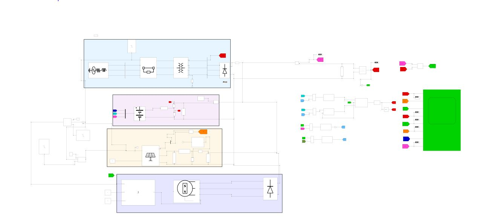
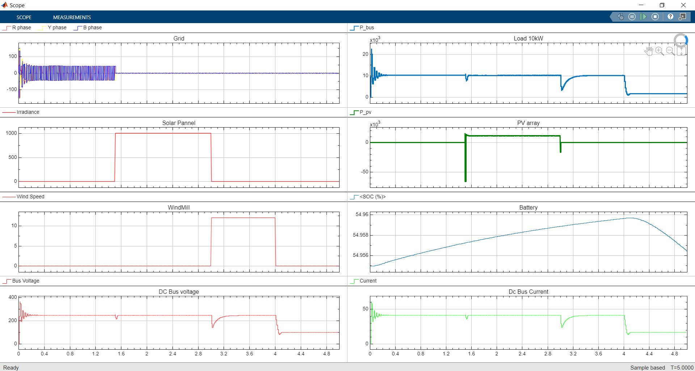

Technical Overview
This project features a hybrid renewable energy system integrating PV and Wind power with a Battery Management System. I engineered the control logic in MATLAB/Simulink to optimize power flow, manage battery health, and implement automated fault detection. The system ensures high reliability and efficiency under varying environmental conditions.

System Architecture
The architecture consists of a PV Array and a Wind Turbine model working in parallel. A centralized Power Management System (PMS) utilizing State-Flow logic governs the energy distribution. This system coordinates a Lithium-Ion battery bank with integrated charge controllers to prioritize load satisfaction and maintain the battery State of Charge (SoC).

Getting Started
To run this simulation, you will need MATLAB version 2025b along with the Simulink and Simscape Electrical toolboxes. After cloning the repository, open the principal simulation file and run the model to observe the coordinated transition between power sources via the Scope blocks.

Performance and Results
The simulation successfully demonstrates a stable 250v DC output even during fluctuating wind speeds and solar irradiance. By implementing automated fault detection, the system can reconfigure its parameters in real-time to prevent power loss and protect sensitive electronics within the circuit.

